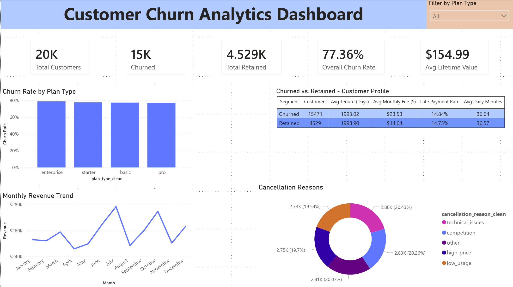
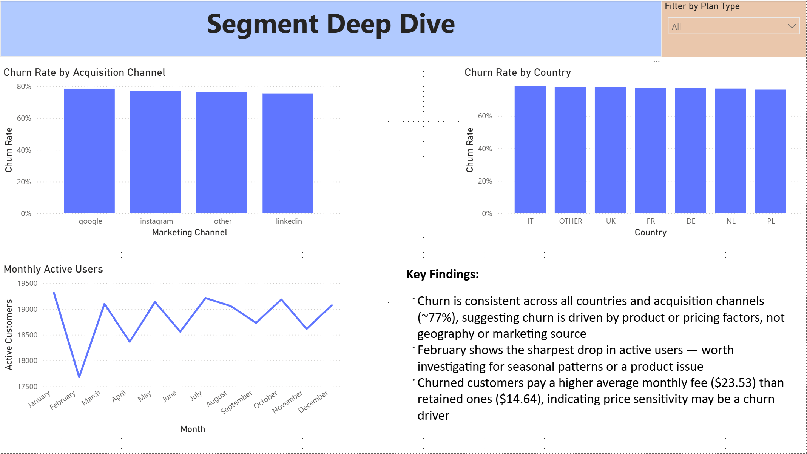

# Churn Analytics Warehouse

A layered SQL data warehouse built in PostgreSQL, with a Power BI dashboard on top. Built on synthetic data designed to mimic the messiness of real production systems — mixed date formats, nulls, duplicated labels, numbers stored as text.

**Stack:** PostgreSQL · SQL · Power BI

---

## Dashboard





The `.pbix` file is in [`power_bi_dashboard/`](power_bi_dashboard/).

---

## Architecture

Four layers, each with a clear purpose:

| Layer | What it does |
|---|---|
| **raw** | CSV files loaded as-is — every column as text, no type assumptions |
| **staging** | Views that clean and standardise the raw data |
| **core** | Persistent dimension and fact tables with PKs, FKs, and indexes |
| **analytics** | Churn labels, customer feature profiles, and KPI rollups |

---

## Key outputs

- `core.dim_customer` — one row per customer with demographics, plan, and churn status
- `core.fact_subscriptions / fact_payments / fact_usage_daily` — event-level fact tables
- `analytics.churn_labels` — churned/retained classification using a 30-day grace period rule
- `analytics.customer_features` — one row per customer: tenure, spend, late payment rate, engagement
- `analytics.churn_rate_by_plan_type / by_country / by_marketing_channel` — KPI tables
- `analytics.monthly_revenue / usage_summary` — time-series aggregations

---

## Quick start

```bash
./run_all.sh -h localhost -p 5432 -d churn_db -U postgres
```

Runs all 13 SQL steps in dependency order and finishes with a full validation suite.

---

## Files

| Path | Description |
|---|---|
| [run_all.sh](run_all.sh) | One-command build script |
| [sql/](sql/) | All SQL organised by layer |
| [sql/validation/validation_suite.sql](sql/validation/validation_suite.sql) | Data quality checks across all layers |
| [sql/analytics/04_business_questions.sql](sql/analytics/04_business_questions.sql) | Five business questions answered with SQL |
| [sql/analytics/05_dashboard_queries.sql](sql/analytics/05_dashboard_queries.sql) | Eight Power BI-ready queries |
| [BUSINESS_OVERVIEW.md](BUSINESS_OVERVIEW.md) | Plain-English write-up for non-technical readers |
| [workflows/build_core_and_analytics.md](workflows/build_core_and_analytics.md) | Technical run guide and churn definition |

---

> **Data:** Fully synthetic. Generated to resemble real subscription data including intentional data quality issues. No real customer information is used.
